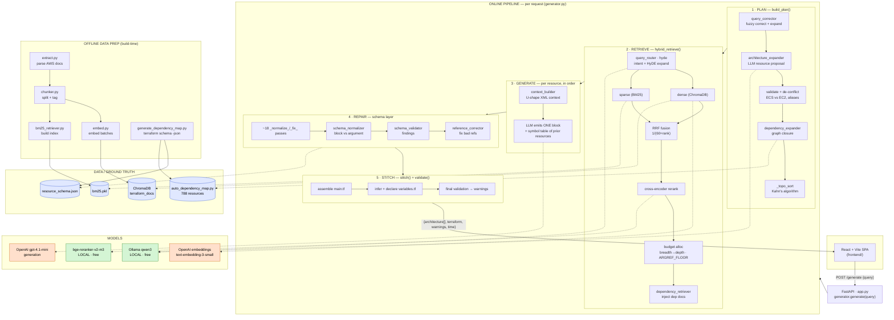

# Terra_Gen_V — Architecture

A one-page view of how a natural-language request becomes valid, deployable Terraform.

**Legend:** 🟩 runs **locally / free** (Ollama + local cross-encoder) · 🟧 **OpenAI API (paid)** · 🟦 **data stores / ground truth**. Only two components are paid — embeddings and final generation — which is why the project runs lean.

## Reading the diagram

The system has two pipelines:

- **Online (per request):** the five numbered stages — Plan, Retrieve, Generate, Repair, Stitch — run for every `POST /generate` call.
- **Offline (build-time):** the data-prep pipeline builds the ChromaDB vector store, the BM25 index, the provider schema ground truth, and the dependency map that the online pipeline reads from.

### The five stages

1. **Plan** — correct the query, propose resources with a local LLM, drop unknowns and resolve conflicts, close the dependency graph, then topologically sort with Kahn's algorithm so dependencies come before dependents.
2. **Retrieve** — optional HyDE expansion, parallel dense + sparse search, Reciprocal Rank Fusion, cross-encoder reranking, breadth-then-depth budget allocation, and dependency-doc injection.
3. **Generate** — for each resource in dependency order, build a U-shaped XML context and emit a single HCL block, passing a symbol table of already-generated resources so references resolve.
4. **Repair** — run targeted normalization passes plus schema-grounded normalization, validation, and reference correction against the real provider schema.
5. **Stitch** — assemble `main.tf`, infer and declare any missing variables in `variables.tf`, and run a final validation pass that emits warnings.

For a full narrative walkthrough of each component, see the [TUTORIAL](TUTORIAL.md). For setup and usage, see the [README](README.md).
