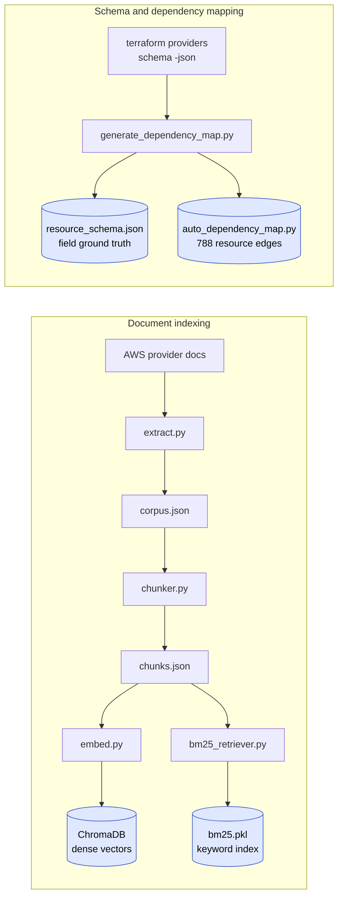

# Terra_Gen_V — Architecture

How a plain-English request becomes valid, deployable Terraform.

The system has two pipelines:

- **Request pipeline** (Diagram 1) — runs on every `POST /generate` call. Five ordered stages: Plan → Retrieve → Generate → Repair → Stitch.
- **Build pipeline** (Diagram 2) — runs once, ahead of time, to prepare the search indexes and ground-truth data the request pipeline reads from.

---

## Diagram 1 — The request pipeline

Read top to bottom. Each stage finishes before the next begins, and the steps inside each box run in the listed order.

```mermaid
flowchart TD
    Q["USER QUERY<br/>e.g. 'an HA web app with autoscaling and a managed database'"]
    API["FastAPI — POST /generate"]

    S1["STAGE 1 — PLAN  (decide WHAT to build)<br/>　<br/>1. correct and expand the query<br/>2. propose resources&nbsp;&nbsp;→ Ollama, local<br/>3. drop unknowns and resolve conflicts<br/>4. add missing dependencies&nbsp;&nbsp;→ dependency map<br/>5. order them with Kahn's topological sort"]

    S2["STAGE 2 — RETRIEVE  (gather the RIGHT docs)<br/>　<br/>1. optional HyDE query expansion&nbsp;&nbsp;→ Ollama, local<br/>2. dense + sparse search in parallel&nbsp;&nbsp;→ ChromaDB, BM25<br/>3. fuse both rankings with RRF<br/>4. rerank the shortlist&nbsp;&nbsp;→ cross-encoder, local<br/>5. share the doc budget across all resources"]

    S3["STAGE 3 — GENERATE  (write HCL, one block at a time)<br/>　<br/>for each resource, in dependency order:<br/>1. build a U-shaped context from its docs<br/>2. generate one resource block&nbsp;&nbsp;→ OpenAI gpt-4.1-mini<br/>3. feed it a symbol table of already-built resources"]

    S4["STAGE 4 — REPAIR  (make it VALID)<br/>　<br/>1. run ~18 targeted normalization passes<br/>2. fix block-vs-argument mistakes&nbsp;&nbsp;→ provider schema<br/>3. correct invalid resource references"]

    S5["STAGE 5 — STITCH  (assemble and verify)<br/>　<br/>1. assemble main.tf<br/>2. infer and declare any missing variables.tf<br/>3. run final validation and collect warnings"]

    OUT["TERRAFORM OUTPUT<br/>main.tf + variables.tf · resource list · warnings"]

    Q --> API --> S1 --> S2 --> S3 --> S4 --> S5 --> OUT

    classDef io fill:#e8eefc,stroke:#3355cc,color:#000,font-weight:bold;
    classDef stage fill:#f5f7fb,stroke:#5a6b8c,color:#000;
    class Q,API,OUT io;
    class S1,S2,S3,S4,S5 stage;
```

**The two key ideas, visible in the order above:**

- **Plan before generate.** Stage 1 produces a *dependency-ordered* list. By the time Stage 3 writes `aws_subnet`, the `aws_vpc` it references already exists — so it can reference it correctly via the symbol table.
- **Repair before output.** The model's first draft (Stage 3) is never trusted as-is. Stage 4 validates and fixes it against the real Terraform provider schema, which is what makes the output pass `terraform validate`.

---

## Diagram 2 — The build pipeline (runs once, offline)

This prepares the four data assets the request pipeline depends on.

---

## Who uses what

Which request stage reads which build-time asset:

| Build-time asset | Built by | Used by request stage |
|---|---|---|
| ChromaDB (dense vectors) | `embed.py` | Stage 2 — Retrieve |
| `bm25.pkl` (keyword index) | `bm25_retriever.py` | Stage 2 — Retrieve |
| `resource_schema.json` (field ground truth) | `generate_dependency_map.py` | Stage 4 — Repair |
| `auto_dependency_map.py` (788 edges) | `generate_dependency_map.py` | Stage 1 — Plan |

---

## Models and cost

Most of the pipeline runs locally and free. Only two calls hit a paid API — embeddings and final generation — which is why the project runs lean.

| Model | Where it runs | Used for | Cost |
|---|---|---|---|
| `qwen3` (Ollama) | Local | Resource planning + HyDE expansion | Free |
| `ms-marco-MiniLM-L6-v2` (live; bge-reranker-v2-m3 benchmarked) | Local | Reranking retrieved docs | Free |
| `text-embedding-3-small` (OpenAI) | API | Embeddings (mostly one-time index build) | Paid |
| `gpt-4.1-mini` (OpenAI) | API | Generating each HCL block | Paid |

---

For a full narrative walkthrough of every component, see the [TUTORIAL](TUTORIAL.md). For setup and usage, see the [README](README.md).
