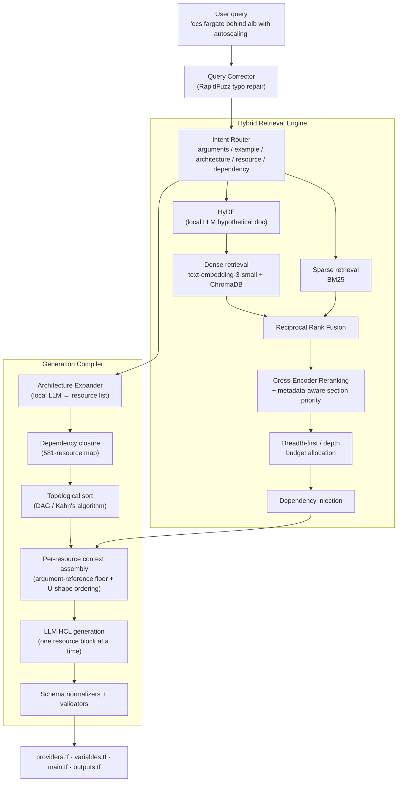

# Terra-Gen — AI Infrastructure Engineer for Terraform

> Turn a sentence into a deployable, dependency-correct AWS Terraform stack.
>
> **"ecs fargate service behind alb with autoscaling"** → planned, ordered, and generated `providers.tf` / `variables.tf` / `main.tf` / `outputs.tf`.

Terra-Gen is a production-grade **Retrieval-Augmented Generation (RAG)** platform that converts natural-language architecture requests into validated, multi-resource Terraform (HCL). It pairs a high-precision hybrid retrieval engine over the **full HashiCorp AWS provider documentation** with a **dependency-aware generation compiler** that plans an entire architecture, resolves resource ordering as a graph problem, and generates each resource block with grounded, hallucination-resistant context.

This is not a thin wrapper around an LLM. It is a multi-stage information-retrieval and code-generation system with its own query understanding layer, fusion ranking, reranking, dependency graph, and an evaluation harness with locked benchmarks.

---

## Why this project is interesting

- **Real retrieval engineering, measured.** Dense + sparse hybrid retrieval, Reciprocal Rank Fusion (RRF), and cross-encoder reranking — evaluated against a hand-built golden dataset with **Recall@8 = 1.00 and MRR = 0.94**.
- **Architecture-aware, not single-resource.** A request like "RDS MySQL database" automatically expands to the VPC, subnet, security group, and DB subnet group it actually needs.
- **Graph-based dependency resolution.** Resources are modeled as a **Directed Acyclic Graph (DAG)** and topologically sorted (Kahn's algorithm) so dependencies are always generated before the resources that reference them.
- **Hallucination-resistant generation.** The model is constrained to the retrieved Argument Reference documentation, with an argument-reference "floor" guaranteeing each resource gets enough schema to pass `terraform validate`.
- **Fault-tolerant by design.** Local LLM (Ollama) steps degrade gracefully to keyword retrieval if the model is unavailable; OpenAI calls use exponential-backoff retries; embeddings and architecture plans are cached.

---

## Benchmark results

Measured on the golden evaluation set (`evaluation/golden_queries.json`) via `golden_evaluation.py`:

| Metric        | Score |
|---------------|-------|
| Recall@8      | **1.000** |
| MRR           | **0.942** |
| Success@1     | **0.884** |
| nDCG@8        | **0.806** |

> Recall@8 = 1.0 means the correct resource documentation was retrieved within the top 8 chunks for **every** query in the set; MRR = 0.94 means the correct chunk was almost always ranked first or second.

Evaluation philosophy is locked in `evaluation/retrieval_baseline.md`: **no retrieval tuning without benchmark evidence, and no optimizing for single-query overfitting.**

---

## How it works

Terra-Gen runs in two cooperating stages: a **Retrieval Engine** that finds the right documentation, and a **Generation Compiler** that turns a plan into code.



### 1. Query understanding
- **Typo repair** (`query_corrector.py`): RapidFuzz fixes malformed resource names (`aws_intance` → `aws_instance`) *before* they can poison downstream LLM steps.
- **Intent routing** (`query_router.py`): classifies each query into `arguments`, `example`, `architecture`, `resource`, or `dependency` to steer retrieval and reranking.

### 2. Hybrid retrieval (`hybrid_retriever.py`)
- **Dense** semantic search (OpenAI `text-embedding-3-small` over ChromaDB) for natural-language intent.
- **Sparse** BM25 for exact Terraform terminology and entity recovery.
- **HyDE** (`hyde.py`): for conceptual queries with no resource names, a local LLM writes a hypothetical doc snippet that carries the vector search to the right chunk. Skipped automatically for short/keyword queries.
- **Reciprocal Rank Fusion** merges both rankings, followed by **cross-encoder reranking** (`reranker.py`) with metadata-aware section prioritization (Argument Reference > Example Usage > Overview).
- **Breadth-first budget allocation** guarantees every planned resource gets context, instead of a few dominant entities (e.g. `aws_ecs_service`) eating the entire token budget.

### 3. Generation compiler (`generator.py`)
- **Architecture expansion** (`architecture_expander.py`): a local LLM returns the complete set of resources an architecture needs, refined by a deterministic completion map (e.g. an ALB implies a listener, target group, and security group).
- **Dependency closure + topological sort**: resources are expanded against the dependency map and ordered with Kahn's algorithm so every dependency is emitted before its dependents.
- **Grounded, per-resource generation**: each resource block is generated individually against its own retrieved Argument Reference context, under a strict system prompt (provider-5.x only, no invented arguments, references over hardcoded values). An **argument-reference floor** tops up schema coverage so partially-retrieved resources still validate.
- **Lost-in-the-middle mitigation** (`context_builder.py`): retrieved chunks are reordered into a U-shape so the strongest evidence sits where the LLM attends most.
- **Schema normalizers** repair known edge cases (e.g. injecting a required `viewer_certificate` block for CloudFront, stripping invalid RDS parameter blocks).

### 4. Output
A complete, multi-file Terraform module: `providers.tf`, `variables.tf`, `main.tf`, and `outputs.tf`, with cross-resource references wired up (`aws_vpc.main.id`, `aws_iam_role.main.arn`, …).

---

## Engineering highlights

- **Fault tolerance** — If Ollama (HyDE / architecture expansion) is unavailable, the pipeline falls back to keyword retrieval and still returns correct results. OpenAI calls retry with exponential backoff (`tenacity`).
- **Caching** — Query embeddings (`lru_cache`) and architecture plans (versioned disk cache) avoid repeated model calls.
- **Telemetry** — The dense retriever tracks latencies, cache hit rates, similarity, and error counts.
- **Concurrency** — Dense and sparse retrieval run in parallel with per-engine timeouts.
- **Pluggable models** — Reranker and generation models are swappable via configuration (cross-encoder MiniLM by default, with `BAAI/bge-reranker-v2-m3` supported).

---

## Tech stack

| Layer | Technology |
|-------|-----------|
| Language | Python |
| Generation LLM | OpenAI GPT-4.1 family (configurable via `OPENAI_MODEL`) |
| Embeddings | OpenAI `text-embedding-3-small` |
| Local LLM (HyDE + architecture) | Ollama (`qwen3`) |
| Vector store | ChromaDB |
| Sparse retrieval | BM25 (`rank-bm25`) |
| Reranking | `sentence-transformers` CrossEncoder |
| Resilience | `tenacity` retries, graceful degradation |
| API / UI (optional) | FastAPI, Uvicorn, Chainlit |
| Evaluation | Custom golden-dataset harness (Recall / MRR / nDCG / Success@1) |

---

## Repository structure

```
Terra_Gen_V/
├── Query understanding
│   ├── query_corrector.py        # RapidFuzz typo / alias repair
│   ├── query_router.py           # Intent classification
│   └── hyde.py                   # Hypothetical Document Embeddings (local LLM)
├── Retrieval
│   ├── retriever.py              # Dense (ChromaDB) retrieval + telemetry
│   ├── bm25_search.py            # Sparse BM25 retrieval
│   ├── hybrid_retriever.py       # RRF fusion + reranking + budget allocation
│   ├── reranker.py               # Cross-encoder reranking
│   └── dependency_retriever.py   # Architecture dependency injection
├── Generation
│   ├── architecture_expander.py  # NL → complete AWS resource set
│   ├── auto_dependency_map.py    # 581-resource dependency graph
│   ├── generator.py              # Plan → topo-sort → per-resource HCL
│   └── context_builder.py        # XML context + lost-in-the-middle ordering
├── Indexing
│   ├── chunker.py / embed.py     # Doc chunking + embedding pipeline
│   └── schema_index.py           # Schema-driven indexing
└── evaluation/
    ├── golden_queries.json       # Retrieval golden set
    ├── generation_eval.json      # Generation golden set
    ├── golden_evaluation.py      # Recall / MRR / nDCG harness
    └── retrieval_baseline.md     # Locked evaluation contract
```

---

## Getting started

> Requires Python 3.10+, an OpenAI API key, and (optionally) a local [Ollama](https://ollama.com) install for HyDE and architecture expansion.

```bash
# 1. Install dependencies
pip install -r requirements.txt

# 2. Configure environment
export OPENAI_API_KEY=sk-...
export OPENAI_MODEL=gpt-4.1-mini      # optional
export OLLAMA_HOST=http://localhost:11434   # optional, for HyDE / architecture

# 3. (Optional) pull the local model used for HyDE + architecture expansion
ollama pull qwen3

# 4. Generate Terraform from a natural-language request
python generator.py
```

Try queries such as:

- `rds mysql database`
- `ecs fargate service behind alb with autoscaling`
- `lambda eventbridge trigger`
- `jump box ec2 ssh`

### Run the evaluation harness

```bash
python golden_evaluation.py      # retrieval: Recall@8 / MRR / nDCG / Success@1
python generation_eval.py        # generation: required-resource coverage
```

---

## Roadmap

- Resource cardinality awareness (`count` / `for_each`) carried through the symbol table
- Intent-aware HyDE and an expanded synonym/ontology layer
- Multi-cloud provider support beyond AWS
- Cost-guard estimation around generated architectures

---

*Terra-Gen is an applied research project in retrieval-augmented infrastructure engineering — combining information retrieval, graph algorithms, and LLM orchestration to make infrastructure-as-code authoring faster, safer, and grounded in real provider documentation.*
